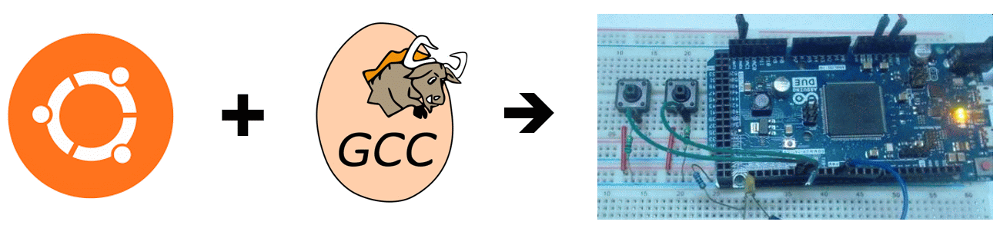

# Ubuntu embedded C++20 setup

Follow these instructions to turn an x86_64 PC 
into an Ubuntu workstation for embedded C++ 20 programming,
using my bmptk (build scripts) and hwlib (hardware library).
Currently supported targets: 
- AVR8 (Arduino Uno)
- ARM/Cortex (Arduino Due, Blue Pill, Teensy 4.0, LPC1114)
- native (Ubuntu x86_64, Windows; both use SFML)

These are the GCC/G++ compilers used:
- AVR8 : https://github.com/CrustyAuklet/avr-libstdcxx/releases
- ARM/Cortex : https://github.com/xpack-dev-tools
- native gcc-10 from the Ubuntu repos

I could add other targets (like MSP430, ESP32, RISC V)
when someone can point me to a GCC/G++ 10 build.

## Install Ubuntu

I used the 20.04 LTS ISO from
https://ubuntu.com/download/desktop. 
My installation might not work other versions.
I created a bootable USB using rufus,
according to the instructions at 
https://ubuntu.com/tutorials/create-a-usb-stick-on-windows.
I booted the PC form the USB stick, 
and followed the instructions, using the default options.

## Download an run the installation script

Log in, open a shell, and run these commands:
````shell
    sudo apt install -y git
    git clone https://www.github.com/wovo/ubuntu-toolchains
    source ubuntu-toolchains/install
````    
The appropriate path additions are made to /etc/environment.
Log out and log back in.
    
## run a blinky from the shell

You can build and run an example from its directory in a shell.
Connect your Arduino Uno or Arduino Due.
In the shell, cd to ~/hwlib-examples/arduin-uno/blink-gpio
or ~/hwlib-examples/arduin-due/blink-gpio.
Run the command
````shell
    make run
````
to build the example, download it to your 
target and run it there.
You should see the LED on your Arduino blink.

## use with CodeLite

You can build and run an example from the CodeLite editor.
In the shell, cd to the examples root for your Arduino
(~/hwlib-examples/arduin-uno or ~/hwlib-examples/arduino-due).
Run the command
````shell
    make codelite_workspace
````    
This creates a __codelite.workspace file.
Open this file with CodeLite.
Accept the defaults.
In the left pane, you see the examples as individual projects.
Double-click on a project to select it.
Click Build => Run to run the project.
When asked, select 'Build and Execute', and select 'Remember my answer'.
When asked to select a compiler, just select one, it doesn't matter which,
because the makefile (not CodeLite) will determine which toolchain is used.

